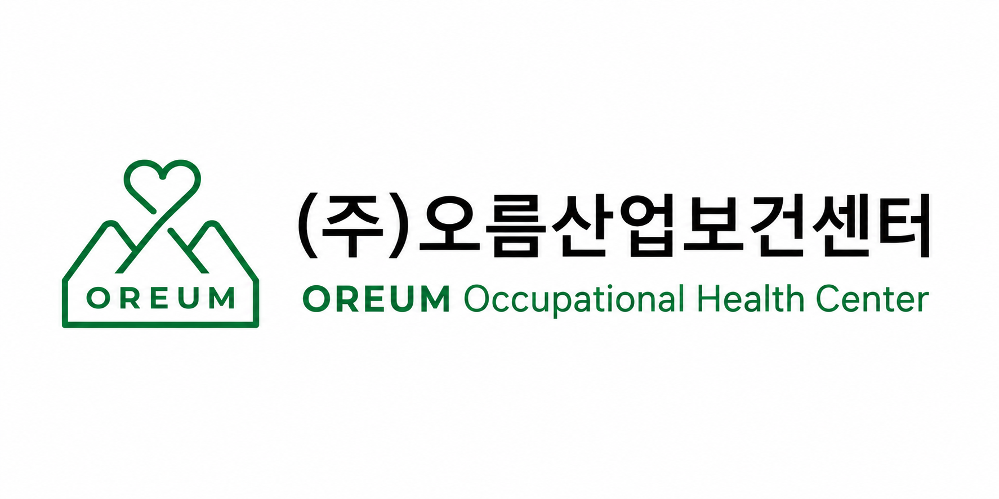

<!DOCTYPE html><html lang="ko"><head><meta charset="UTF-8"/><meta name="viewport" content="width=device-width, initial-scale=1.0"/><title>㈜오름산업보건센터 | OREUM Occupational Health Center</title><meta name="description" content="제주 사업장의 보건관리업무 위탁, 작업환경관리, 근골격계 유해요인조사, 위험성평가, 산업안전보건교육을 지원하는 고용노동부 지정 보건관리전문기관입니다."><meta property="og:title" content="㈜오름산업보건센터"><meta property="og:description" content="근로자의 건강을 오르게, 사업장의 안전보건문화를 오르게 합니다."><link rel="stylesheet" href="style.css"/></head><body>
<header class="site-header">
<nav class="nav"><a href="#about">회사소개</a><a href="#services">주요업무</a><a href="#contact">문의하기</a></nav><a class="phone-btn" href="tel:064-738-5657">064-738-5657</a>
</header>
<main id="home"><section class="hero">

<strong>고용노동부 지정</strong>보건관리전문기관

제주 사업장의 산업보건 전문 파트너
<h1>근로자의 건강을 오르게, 사업장의 안전보건문화를 오르게 합니다.</h1>
산업보건지도사 · 간호사 · 산업위생관리기사의 전문성을 갖춘 보건관리전문가가 담당자 변경 없이 지속적으로 사업장을 관리합니다.

<a class="primary" href="#contact">상담 문의하기 →</a><a class="secondary" href="#services">주요업무 보기</a>

</section>
<section class="quick-services">
<a href="#service-01"><i>👥</i>보건관리업무 위탁</a><a href="#service-03"><i>🦴</i>근골격계 유해요인조사</a><a href="#service-04"><i>📋</i>위험성평가</a><a href="#service-07"><i>🧠</i>직무스트레스 평가</a><a href="#service-08"><i>🛡️</i>안전보건관리체계 구축</a><a href="#service-06"><i>🎓</i>산업안전보건교육</a>
</section>
<section class="intro" id="about">

About OREUM
<h2>사업장의 건강한 일터를 위한 산업보건 전문기관</h2>

㈜오름산업보건센터는 산업안전보건법에 따른 보건관리업무를 기반으로 사업장의 작업환경관리와 근로자 건강보호를 지원합니다.

오름은 한 걸음씩 오를수록 더 넓은 시야를 보여줍니다. 오름산업보건센터는 사업장의 산업보건 수준을 함께 오르게 하는 지속적인 파트너가 되겠습니다.

산업보건지도사간호사산업위생관리기사

</section>
<section class="strength">

Why OREUM
<h2>왜 오름산업보건센터인가?</h2>

<article class="reveal"><i>🎖️</i><h3>3가지 전문자격</h3>
산업보건지도사, 간호사, 산업위생관리기사의 전문성을 바탕으로 사업장을 관리합니다.
</article><article class="reveal"><i>🤝</i><h3>담당자 변경 없는 지속관리</h3>
사업장의 특성과 이력을 이해하고, 일관성 있는 보건관리 서비스를 제공합니다.
</article><article class="reveal"><i>⚖️</i><h3>산안법 기반 업무수행</h3>
산업안전보건법, 시행령, 시행규칙 및 고용노동부 고시를 기준으로 업무를 수행합니다.
</article><article class="reveal"><i>🌿</i><h3>제주 사업장 맞춤 대응</h3>
제주 지역 사업장의 업종과 작업환경을 고려하여 현실적인 개선방안을 제시합니다.
</article>

</section>
<section class="services" id="services">

Professional Services
<h2>산업보건 전문서비스</h2>실제로 수행하는 업무 중심으로 명확하게 안내합니다.

<article class="service-card main-service reveal" id="service-01">
👥

<h3>보건관리업무 위탁</h3>
산업안전보건법에 따른 보건관리업무를 위탁 수행하여 사업주의 보건관리 의무 이행과 근로자 건강보호를 지원합니다.
<ul><li>작업환경관리 실태 파악 및 작업장 순회점검</li><li>작업환경측정 결과 검토 및 사후관리</li><li>일반·특수건강진단 결과관리 및 유소견자 사후관리</li><li>보건교육, 응급조치체계, 보건정보관리 지원</li></ul>
</article>
<article class="service-card reveal" id="service-02">
🌬️

<h3>작업환경관리 컨설팅</h3>
작업장 순회점검을 통해 유해요인과 개선사항을 파악하고, 작업환경측정 결과에 따른 사후관리와 작업방법 개선을 지도합니다.
<ul><li>유해작업환경 개선 및 작업방법 지도</li><li>MSDS 관리 및 화학물질 관리 지도</li><li>보호구 착용 및 안전보건표지 관리 지도</li></ul>
</article>
<article class="service-card reveal" id="service-03">
🦴

<h3>근골격계부담작업 유해요인조사</h3>
고용노동부 고시에 따른 조사방법을 적용하여 근골격계부담작업의 유해요인을 조사·평가하고 개선방안을 제시합니다.
<ul><li>근골격계부담작업 해당 여부 검토</li><li>작업자세, 반복동작, 취급중량 등 유해요인 조사</li><li>증상조사 및 인간공학적 평가</li><li>개선 우선순위 및 개선방안 제시</li></ul>
</article>
<article class="service-card reveal" id="service-04">
📋

<h3>위험성평가 및 화학물질 위험성평가</h3>
사업장의 유해·위험요인을 파악하고 위험성 수준을 결정하여, 위험성을 낮추기 위한 감소대책 수립과 실행을 지원합니다.
<ul><li>평가대상 공정 및 작업 선정</li><li>사업장 순회점검 및 근로자 의견청취</li><li>위험성 수준 결정 및 감소대책 수립</li><li>MSDS, 취급량, 노출수준 등을 고려한 화학물질 위험성평가</li></ul>
</article>
<article class="service-card reveal" id="service-05">
❤️

<h3>건강진단 사후관리 및 건강상담</h3>
건강진단 결과를 관리하고 일반질환 및 직업병 유소견자에 대한 사후관리, 만성질환 관리와 건강상담을 지원합니다.
<ul><li>일반·특수건강진단 결과관리 및 결과 설명</li><li>만성질환자 및 유소견자 사후관리</li><li>건강생활 실천, 운동·영양·생활습관 개선 지도</li></ul>
</article>
<article class="service-card reveal" id="service-06">
🎓

<h3>산업안전보건교육</h3>
사업장에 필요한 산업안전보건교육을 법정교육 기준과 작업 특성에 맞게 운영할 수 있도록 지원합니다.
<ul><li>근로자 정기 안전보건교육</li><li>관리감독자 안전보건교육</li><li>채용 시 및 작업내용 변경 시 교육</li><li>특별교육 및 MSDS 교육</li></ul>
</article>
<article class="service-card reveal" id="service-07">
🧠

<h3>직무스트레스 요인평가</h3>
KOSHA GUIDE의 직무스트레스 요인 측정 기준을 활용하여 근로자의 직무스트레스 요인을 평가하고 개선방안을 제시합니다.
<ul><li>8개 영역 직무스트레스 요인 측정</li><li>부서별·직군별 결과 분석</li><li>고위험군 및 취약요인 분석</li><li>개선방안 및 결과보고서 작성</li></ul>
</article>
<article class="service-card reveal" id="service-08">
🛡️

<h3>안전보건관리체계 구축</h3>
사업장의 규모와 업종 특성을 고려하여 실질적으로 운영 가능한 안전보건관리체계 구축과 지속적 개선을 지원합니다.
<ul><li>사업장 안전보건 수준 진단</li><li>위험요인 파악 및 개선대책 수립</li><li>비상조치계획 및 근로자 참여체계 마련</li><li>평가 및 지속적 개선 지원</li></ul>
</article>

</section><section class="process">

Process
<h2>보건관리업무 위탁 절차</h2>

STEP 01<strong>상담 및 사업장 현황 확인</strong>

STEP 02<strong>사업장 방문 및 위탁계약</strong>

STEP 03<strong>연간 보건관리계획 수립</strong>

STEP 04<strong>정기 방문 및 보건관리업무 수행</strong>

STEP 05<strong>보고서 제출 및 사후관리</strong>

</section>
<section class="contact" id="contact">

Contact
<h2>사업장 보건관리업무 위탁 상담</h2>
제주 사업장의 보건관리업무 위탁 및 산업보건 컨설팅 관련 문의를 남겨주세요.

<a href="tel:064-738-5657">대표전화 064-738-5657</a><a href="tel:010-3752-6474">휴대전화 010-3752-6474</a>팩스 0504-315-6474<a href="mailto:oreumhealth@gmail.com">oreumhealth@gmail.com</a>제주특별자치도 서귀포시 서호중앙로 55 A동 301호<a class="map-link" href="https://map.naver.com/p/search/%EC%A0%9C%EC%A3%BC%20%EC%84%9C%EA%B7%80%ED%8F%AC%EC%8B%9C%20%EC%84%9C%ED%98%B8%EC%A4%91%EC%95%99%EB%A1%9C%2055" target="_blank" rel="noopener">지도에서 보기</a>

</section></main><footer>

<strong>㈜오름산업보건센터</strong>OREUM Occupational Health Center

주소: 제주특별자치도 서귀포시 서호중앙로 55 A동 301호전화: 064-738-5657휴대전화: 010-3752-6474팩스: 0504-315-6474이메일: oreumhealth@gmail.com
<small>Copyright © ㈜오름산업보건센터. All Rights Reserved.</small>
</footer><a class="floating-call" href="tel:064-738-5657">전화 문의</a></body></html>